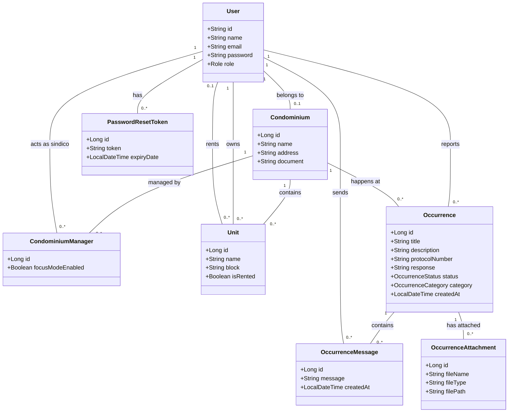

# condoflow
O CondoFlow é uma plataforma voltada para a gestão de ocorrências em condomínios, desenhada para atender tanto moradores quanto síndicos profissionais que gerenciam múltiplas unidades. O foco central é a transparência, a rastreabilidade e a privacidade.

## Arquitetura de Dados (UML)

## SonarCloud 
