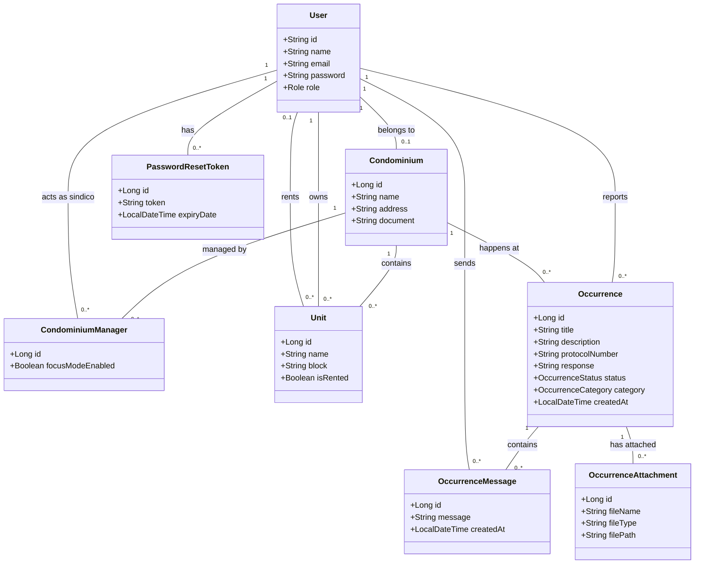

<p align="center">
  <h1 align="center">🏢 CondoFlow</h1>
  <p align="center">
    <strong>Plataforma SaaS moderna para gestão inteligente de ocorrências em condomínios.</strong>
  </p>
  <p align="center">
    <a href="https://sonarcloud.io/summary/new_code?id=jonathanspereira_condoflow">
      
    </a>
  </p>
</p>

---

## 📌 Sobre o Projeto

O **CondoFlow** nasceu para revolucionar a forma como moradores e síndicos (especialmente síndicos profissionais que gerenciam múltiplas unidades) se comunicam. O foco central da plataforma é a **transparência, rastreabilidade e privacidade**, acabando com grupos de WhatsApp desorganizados e livros de ocorrência de papel.

## 🚀 Principais Funcionalidades

### 👨‍💼 Para o Síndico (Gestor)
- **Modo Foco (Multi-Condomínios):** Síndicos profissionais podem alternar a visão entre diferentes condomínios com um clique, sem perder o contexto.
- **Dashboard Analítico:** Visão global de ocorrências abertas, resolvidas e tempo médio de resposta.
- **Gestão de Unidades e Moradores:** Importação de unidades em massa e controle total de acessos.
- **Planos e Assinaturas:** Sistema SaaS integrado com diferentes tiers de planos (Trial Free, Mensal, Anual).

### 🏠 Para o Morador
- **Ocorrências Anônimas ou Identificadas:** Liberdade e segurança para relatar problemas sem exposição indesejada.
- **Acompanhamento por Protocolo:** Rastreabilidade ponta a ponta do status de cada relato.
- **Anexos e Multimídia:** Envio de fotos e vídeos direto na ocorrência.
- **Chat Integrado:** Comunicação direta com a administração dentro da própria plataforma.

---

## 🛠️ Tecnologias Utilizadas

O CondoFlow adota uma arquitetura moderna, escalável e segura:

**Frontend:**
- [Next.js (App Router)](https://nextjs.org/) - Framework React para SSR/SSG.
- [TailwindCSS](https://tailwindcss.com/) & [shadcn/ui](https://ui.shadcn.com/) - Estilização elegante e componentes acessíveis.
- [Cloudflare Turnstile](https://www.cloudflare.com/products/turnstile/) - Proteção anti-bot sem fricção.

**Backend:**
- [Java 21](https://jdk.java.net/21/) & [Spring Boot 3.4](https://spring.io/projects/spring-boot) - API RESTful robusta.
- [Spring Security](https://spring.io/projects/spring-security) & JWT - Autenticação e autorização seguras.
- [Swagger / OpenAPI](https://swagger.io/) - Documentação automatizada de APIs.
- [Bucket4j](https://bucket4j.com/) - Rate limiting para proteção de rotas públicas.

**Infraestrutura & Banco de Dados:**
- [PostgreSQL](https://www.postgresql.org/) & [Supabase](https://supabase.com/) - Banco de dados relacional em nuvem.
- [Render](https://render.com/) & [Vercel](https://vercel.com/) - Deploy contínuo do backend e frontend.
- [SonarCloud](https://sonarcloud.io/) - Análise estática de código e qualidade.

---

## 🏗️ Arquitetura de Dados (UML)

Abaixo o modelo conceitual do banco de dados relacional:



---

## ⚙️ Como Executar Localmente

**1. Clone o repositório**
```bash
git clone https://github.com/jonathanspereira/condoflow.git
cd condoflow
```

**2. Backend (Spring Boot)**
```bash
cd backend
mvn clean install
mvn spring-boot:run
```
*A API estará disponível em `http://localhost:8080` (Acesse o Swagger em `/swagger-ui.html`).*

**3. Frontend (Next.js)**
```bash
cd frontend
npm install
npm run dev
```
*A aplicação web estará disponível em `http://localhost:3000`.*

---

<p align="center">
  Desenvolvido com 💻 e ☕ por <a href="https://github.com/jonathanspereira">Jonathan Pereira</a>.
</p>